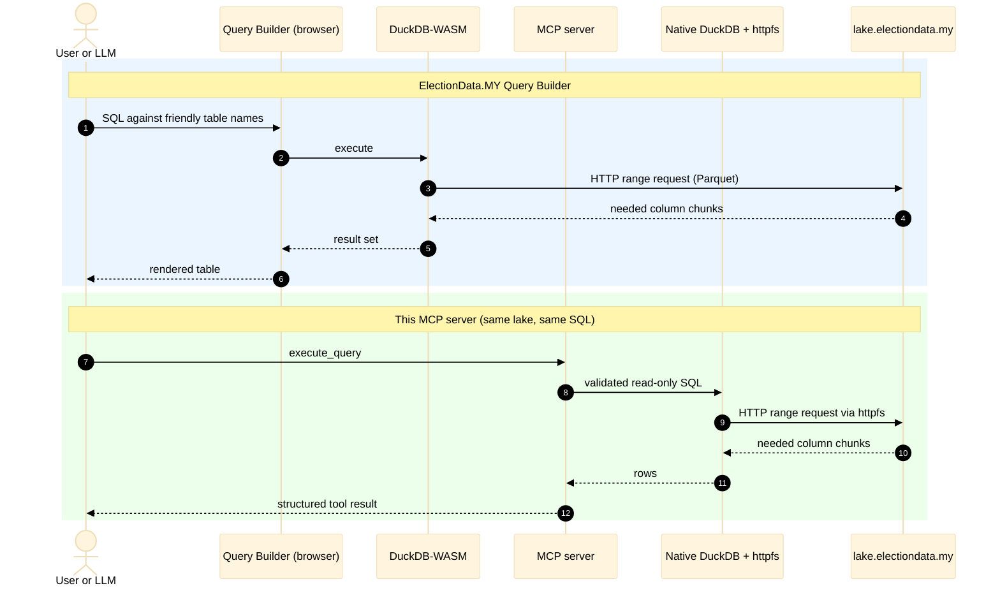

- [ElectionData.MY MCP Server](#electiondatamy-mcp-server-unofficial)
  - [What's exposed](#whats-exposed)
  - [Installation](#installation)
  - [Usage](#usage)
    - [Claude Desktop](#claude-desktop)
    - [Claude Code](#claude-code)
    - [Cursor](#cursor)
    - [Sample Conversations](#sample-conversations)
  - [Development](#development)
    - [From a local checkout](#from-a-local-checkout)
  - [Design & Implementation](#design--implementation)
    - [The DuckDB-WASM approach](#the-duckdb-wasm-approach)
    - [Safety model](#safety-model)
    - [Querying the lake directly](#querying-the-lake-directly)
    - [Relation to the ElectionData.MY API](#relation-to-the-electiondatamy-api)
  - [Contributing](#contributing)
  - [License](#license)
  - [Acknowledgments](#acknowledgments)

# ElectionData.MY MCP Server (unofficial)

An MCP server that lets an LLM answer questions about Malaysian elections by writing DuckDB SQL against the public [ElectionData.MY](https://electiondata.my/) data lake — every Parliament and DUN contest ever held, down to saluran-level ballots and voter rolls.

No API key, no database to provision, no data to download. The lake is public Parquet over HTTP and DuckDB reads it in place. This is with special thanks to the [ElectionData.MY](https://electiondata.my/) team for making the data available!

**NOTE: This is an unofficial project and is not affiliated with the ElectionData.MY team.** Please support their work by visiting their website!

## What's exposed

| Kind | Name | Purpose |
| --- | --- | --- |
| Tool | `list_datasets` | Every lake table, its URL, a description, and whether it streams. |
| Tool | `describe_dataset` | Column names and types for one table. |
| Tool | `validate_sql` | Check a query against the safety rules without running it. |
| Tool | `sample_dataset` | A few rows from a table, for shape-checking. |
| Tool | `execute_query` | Run validated read-only SQL; returns columns, rows, and elapsed time. |
| Resource | `electiondata://query-guide` | Schema and SQL rules from the [Query Builder](https://electiondata.my/query-builder/). |
| Prompt | `build_election_query` | Loads the guide and asks for a single query answering a question. |

The guide is the Query Builder's own [`copy-prompt.md`](https://github.com/electiondata-my/meco-front/blob/main/src/components/tools/query-builder/copy-prompt.md),
fetched at runtime and cached for 24 hours under `$XDG_CACHE_HOME/electiondata-my-mcp/`. If GitHub is unreachable, a stale cache is used, then the bundled copy.

## Installation

Requires [uv](https://docs.astral.sh/uv/) (which provides `uvx`) and Python 3.11+.

The server is on [PyPI](https://pypi.org/project/electiondata-my-mcp/). You do not need to clone this repository to use it.

```bash
# recommended: no install step; uvx fetches the pinned package
uvx electiondata-my-mcp==0.1.0

# or install from PyPI and run the console script
pip install electiondata-my-mcp==0.1.0
electiondata-my-mcp
```

Either command starts the server on stdio and waits for an MCP client — register it below rather than invoking it by hand.

## Usage

Point your MCP client at `uvx electiondata-my-mcp==0.1.0`. Pin the version so a new release is not picked up automatically; drop the pin to track latest. `uvx` must be on the client's `PATH` — if the client cannot find it, use the absolute path from `which uvx`.

If you installed from PyPI instead of using `uvx`, set `"command"` to `electiondata-my-mcp` and omit `args`.

### Claude Desktop

Add the server to `claude_desktop_config.json`:

- macOS: `~/Library/Application Support/Claude/claude_desktop_config.json`
- Windows: `%APPDATA%\Claude\claude_desktop_config.json`

```json
{
  "mcpServers": {
    "electiondata-my": {
      "command": "uvx",
      "args": [
        "electiondata-my-mcp==0.1.0"
      ]
    }
  }
}
```

Restart Claude Desktop after saving.

### Claude Code

From the terminal:

```bash
claude mcp add --transport stdio --scope user electiondata-my -- uvx electiondata-my-mcp==0.1.0
```

Or write the same JSON into a project `.mcp.json`, or into `~/.claude.json` for a user-wide server:

```json
{
  "mcpServers": {
    "electiondata-my": {
      "command": "uvx",
      "args": [
        "electiondata-my-mcp==0.1.0"
      ]
    }
  }
}
```

Confirm with `claude mcp list`, or `/mcp` inside a session.

### Cursor

Add the server in **Settings → Tools & MCP**, or write it to `~/.cursor/mcp.json` (all projects) or `.cursor/mcp.json` (this workspace):

```json
{
  "mcpServers": {
    "electiondata-my": {
      "command": "uvx",
      "args": [
        "electiondata-my-mcp==0.1.0"
      ]
    }
  }
}
```

### Sample Conversations

- [Q&A with Claude Code ❯ How has the percentage of female MPs changed over time?](https://claude.ai/code/session_01CYGw2Zvt7CPcDqbNLUKwag)
- [Charts from Claude Code Session](https://claude.ai/code/artifact/2dbd6527-de6f-4d1e-b8ee-095116d9f902)

## Development

1. Clone the repository
```bash
git clone https://github.com/wanadzhar913/electiondata-my-mcp.git
cd electiondata-my-mcp
```

2. Install the development dependencies
```bash
uv sync --group dev
```

3. Run & validate the server with the [MCP Inspector](https://modelcontextprotocol.io/docs/2026-07-28/tools/inspector):

```bash
uv run mcp dev src/electiondata_my_mcp/server.py
```

4. Run the tests
```bash
uv run pytest -q
```

5. Run the linter
```bash
uv run ruff check
```

Coverage is enforced at 80%. When the lake gains a dataset, update `DATASETS` in `duckdb_lake.py` alongside upstream `datasets.ts` — the validator's allowlist and the `list_datasets` tool both derive from it.

### From a local checkout

After cloning and `uv sync`, launch the server over stdio from the repo:

```bash
uv run mcp run src/electiondata_my_mcp/server.py
```

Point a client at the checkout instead of PyPI — the same block works in Claude Desktop, Claude Code, and Cursor; only the config file path changes:

```json
{
  "mcpServers": {
    "electiondata-my": {
      "command": "uv",
      "args": [
        "run",
        "--directory",
        "/absolute/path/to/electiondata-my-mcp",
        "mcp",
        "run",
        "src/electiondata_my_mcp/server.py"
      ]
    }
  }
}
```

## Design & Implementation

### The DuckDB-WASM approach

The [Query Builder](https://electiondata.my/) on electiondata.my runs **DuckDB-WASM inside the browser tab**. There is no query backend: the page registers the lake's Parquet files under friendly table names (`headline_ballots`, `voter_roll_ge15`, …) and the browser's WASM DuckDB pulls bytes straight from `https://lake.electiondata.my` over HTTP range requests.

[`duckdb_lake.py`](src/electiondata_my_mcp/duckdb_lake.py) reproduces that exact environment outside the browser, using native DuckDB plus `httpfs` instead of WASM plus `fetch`:

```python
con.execute("INSTALL httpfs; LOAD httpfs;")
con.execute(f"CREATE OR REPLACE VIEW {name} AS SELECT * FROM read_parquet('{url}')")
```

Both paths share the same lake and the same table names. The difference is who runs DuckDB, and how the result is delivered:



Why this matters:

- **SQL is portable in both directions.** The table names mirror [`datasets.ts`](https://github.com/electiondata-my/meco-front/blob/e8f134aab0c2a9a20699c3c2b1f78c2bf733ede9/src/components/tools/query-builder/datasets.ts) in the ElectionData.MY frontend, so a query the model writes here can be pasted into the site's Query Builder unchanged, and the site's published prompt and examples work here unchanged. The model gets the same mental model the website documents.
- **Nothing is copied or mirrored.** Registering views rather than tables means the lake stays the single source of truth. A refreshed Parquet file is picked up on the next query.
- **Only the bytes a query needs cross the network.** Parquet is columnar and `httpfs` speaks HTTP range requests, so a `SELECT seat, majority` touches those column chunks and skips the rest of the file. This is the same property that makes a 22-million-row voter roll queryable from a browser tab, and it is why this server needs no local storage.
- **Voter rolls are never materialised.** `LAZY` marks the `voter_roll_*` tables, mirroring `LAZY_DATASETS` upstream; they always stream. Everything else can be materialised on demand with `--cache`, which trades freshness for repeat-query speed.

The one thing the browser cannot do is the reason this server exists: a WASM tab has no way to hand results to an MCP client. Here, the same queries run in-process and come back as structured tool results.

### Safety model

Every query passes [`query_validator.py`](src/electiondata_my_mcp/query_validator.py) before it reaches DuckDB:

- `SELECT` or `WITH` only, one statement, no trailing second statement.
- DDL, DML, and session keywords (`CREATE`, `ATTACH`, `INSTALL`, `PRAGMA`, `SET`, …) are rejected.
- File and network functions (`read_parquet`, `read_csv`, `glob`, …) are rejected, so the allowlisted views are the only reachable data.
- A query must reference at least one known lake table.
- Anything touching a `voter_roll_*` table must carry `LIMIT 10000` or less — the same rule the website enforces.

`execute_query` returns at most 100 rows by default and 1,000 at the ceiling, flagging `truncated` rather than silently cutting.

### Querying the lake directly

`duckdb_lake.py` is also a standalone CLI and library, useful for checking a query before wiring up a client:

```bash
# list the registered tables and their URLs
uv run src/electiondata_my_mcp/duckdb_lake.py --tables

# one-off query, pretty-printed
uv run src/electiondata_my_mcp/duckdb_lake.py \
    "SELECT seat, majority FROM headline_stats ORDER BY majority DESC LIMIT 5"

# from a file or stdin, as CSV or JSON
uv run src/electiondata_my_mcp/duckdb_lake.py -f query.sql --format csv

# materialise the small tables so repeat queries hit disk, not the network
uv run src/electiondata_my_mcp/duckdb_lake.py --cache lake.duckdb "SELECT ..."
```

```python
from electiondata_my_mcp.duckdb_lake import connect

df = connect().sql("SELECT * FROM headline_ballots LIMIT 10").df()
```

### Relation to the ElectionData.MY API

The lake is for bulk and analytical work. For focused lookups — a candidate's history, a party's record in one state — the [v1 REST API](https://api.electiondata.my/v1) is the better fit; it needs an `ELECTIONDATAMY_API_KEY` and is covered by the `query-electiondatamy-api` skill in `.cursor/skills/`. This server deliberately covers only the lake, which needs no credentials.

## Contributing

1. Fork the repository
2. Create your feature branch (`git checkout -b feature/amazing-feature`)
3. Commit your changes (`git commit -m 'Add amazing feature'`)
4. Push to the branch (`git push origin feature/amazing-feature`)
5. Open a Pull Request

## License

Much like the [meco-front](https://github.com/electiondata-my/meco-front) repository, this project is released into the public domain under [CC0 1.0 Universal (CC0 1.0) Public Domain Dedication](https://creativecommons.org/publicdomain/zero/1.0/). You are free to use, modify, and distribute the code without any restrictions.

## Acknowledgments

- [ElectionData.MY](https://electiondata.my/) and the [meco-front](https://github.com/electiondata-my/meco-front) Query Builder
- [DuckDB](https://duckdb.org/) and [DuckDB-WASM](https://duckdb.org/docs/api/wasm/overview.html)
- [Model Context Protocol](https://modelcontextprotocol.io)
