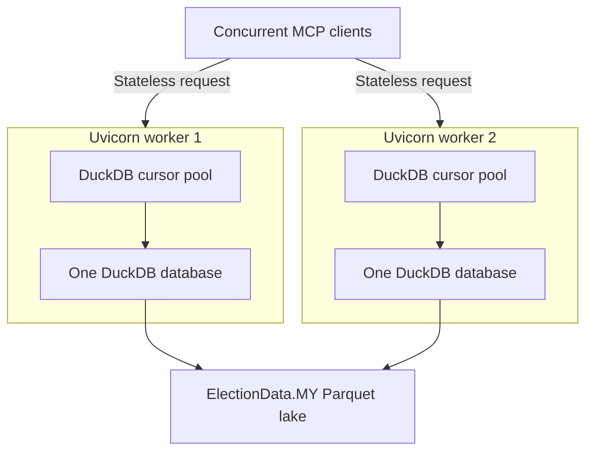
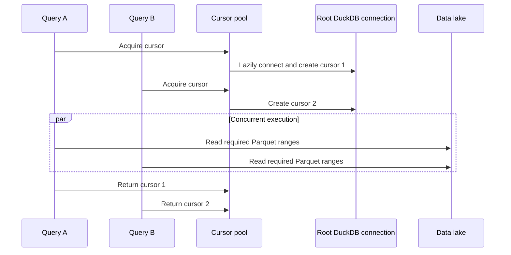
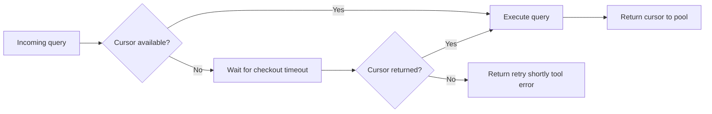

- [Production: Streamable HTTP](#production-streamable-http)
  - [Run](#run)
  - [Client config](#client-config)
  - [Docker](#docker)
  - [Host and Origin allowlists](#host-and-origin-allowlists)
  - [OAuth](#oauth)
    - [Provider Setup](#provider-setup)
  - [Workers](#workers)
- [Design](#design)
  - [Export an ASGI app instead of `mcp.run("streamable-http")`](#export-an-asgi-app-instead-of-mcprunstreamable-http)
  - [Stateless HTTP, one process per worker](#stateless-http-one-process-per-worker)
  - [One DuckDB database per process, cursors for concurrency](#one-duckdb-database-per-process-cursors-for-concurrency)
  - [Backpressure](#backpressure)

# Production: Streamable HTTP

Stdio is the default transport and is what desktop clients (`uvx electiondata-my-mcp`) speak. This page is the HTTP deploy path: a Starlette app from `mcp.streamable_http_app()`, CORS, DNS-rebinding protection, a `/health` route, and uvicorn workers.

## Run

After `pip install electiondata-my-mcp` (or `uvx`):

```bash
# one worker on 127.0.0.1:8000
electiondata-my-mcp --transport streamable-http

# several workers (same flags the CLI would pass to uvicorn)
electiondata-my-mcp --transport streamable-http --host 0.0.0.0 --port 8000 --workers 4
```

Or hand the app to uvicorn yourself:

```bash
uvicorn electiondata_my_mcp.http_app:app --host 0.0.0.0 --port 8000 --workers 4
```

- MCP endpoint: `http://127.0.0.1:8000/mcp`
- Liveness: `GET /health` → `{"status": "ok"}` (unauthenticated)

`--host`, `--port`, `--workers`, `--allowed-host`, `--allowed-origin`, and `--disable-dns-rebinding-protection` are HTTP-only. Passing them with the default stdio transport is an error, so a desktop config cannot accidentally open a port.

POSTs to `/mcp` are Streamable HTTP: send `Accept: application/json, text/event-stream`. Replies are SSE (`event: message` then `data: {jsonrpc…}`). There is no `Mcp-Session-Id` (stateless). Hit `127.0.0.1` or `localhost`; another `Host` is [`421`](https://py.sdk.modelcontextprotocol.io/troubleshooting/?h=421#421-misdirected-request-invalid-host-header) until you allowlist it.

```bash
curl -sS http://127.0.0.1:8000/health
# {"status":"ok"}

curl -sS http://127.0.0.1:8000/mcp \
  -H 'Accept: application/json, text/event-stream' \
  -H 'Content-Type: application/json' \
  -d '{"jsonrpc":"2.0","id":1,"method":"initialize","params":{"protocolVersion":"2025-11-25","capabilities":{},"clientInfo":{"name":"curl","version":"1"}}}'
```

```text
event: message
data: {"jsonrpc":"2.0","id":1,"result":{"protocolVersion":"2025-11-25","capabilities":{…},"serverInfo":{"name":"electiondata-my-mcp",…}}}
```

```bash
curl -sS http://127.0.0.1:8000/mcp \
  -H 'Accept: application/json, text/event-stream' \
  -H 'Content-Type: application/json' \
  -d '{"jsonrpc":"2.0","id":2,"method":"tools/call","params":{"name":"execute_query","arguments":{"sql":"SELECT seat, majority FROM headline_stats ORDER BY majority DESC LIMIT 3","max_rows":3}}}'
```

```text
event: message
data: {"jsonrpc":"2.0","id":2,"result":{"isError":false,"structuredContent":{"columns":["seat","majority"],"rows":[{"seat":"P.106 Damansara","majority":124619},{"seat":"P.104 Subang","majority":115074},{"seat":"P.106 Damansara","majority":106903}],"row_count":3,"truncated":false,"elapsed_ms":105.67}}}
```

`tools/list` and other tools use the same `tools/call` envelope (`list_datasets`, `validate_sql`, `describe_dataset`, `sample_dataset`). Lake queries (`describe_dataset` / `sample_dataset` / `execute_query`) take a moment on first connect.

## Client config

Cursor (user `~/.cursor/mcp.json` or project `.cursor/mcp.json`):

```json
{
  "mcpServers": {
    "electiondata-my": {
      "url": "http://127.0.0.1:8000/mcp"
    }
  }
}
```

Claude Code:

```bash
claude mcp add --transport http electiondata-my http://127.0.0.1:8000/mcp
```

## Docker

The image runs that same app: `uvicorn electiondata_my_mcp.http_app:app` on `0.0.0.0:8000` with four workers by default. Dev dependencies are not installed (`uv sync --frozen --no-dev`).

The worker count is uvicorn's `WEB_CONCURRENCY` (image default `4`), so change it at run time without rebuilding:

```bash
docker build --build-arg VERSION="$(uv version --short)" -t electiondata-my-mcp .
docker run --rm -p 8000:8000 -e WEB_CONCURRENCY=2 electiondata-my-mcp

# verify it works
# add `-H 'Mcp-Protocol-Version: 2025-11-25'` if your client does not support the latest version
curl -sS http://127.0.0.1:8000/mcp \
  -H 'Accept: application/json, text/event-stream' \
  -H 'Content-Type: application/json' \
  -d '{"jsonrpc":"2.0","id":2,"method":"tools/call","params":{"name":"list_datasets","arguments":{}}}'
```

The Dockerfile uses BuildKit cache mounts (`RUN --mount=type=cache`). Docker Buildx does that by default. If `docker build` reports that `--mount` requires BuildKit, prefix the build with `DOCKER_BUILDKIT=1`.

`GET /health` and `POST /mcp` listen on port 8000. `/mcp` accepts a request whose `Host` is `localhost` or `127.0.0.1` (any port), which is what a client on the host sends through `docker run -p 8000:8000`. Another hostname gets [`421`](https://py.sdk.modelcontextprotocol.io/troubleshooting/?h=421#421-misdirected-request-invalid-host-header) from `/mcp` until you allowlist it, same as a non-container deploy:

```bash
docker run --rm -p 8000:8000 \
  -e MCP_ALLOWED_HOSTS='mcp.example.com,mcp.example.com:*' \
  -e MCP_ALLOWED_ORIGINS='https://app.example.com' \
  electiondata-my-mcp
```

The image has a Docker `HEALTHCHECK` that requests `GET /health` on `127.0.0.1:8000` from inside the container. The Host allowlist applies only to `/mcp`, so the check keeps passing after you set `MCP_ALLOWED_HOSTS`. Kubernetes ignores `HEALTHCHECK`; point its probes at `/health` instead.

Pool size is still per worker. The image's default four workers and the default `MCP_DUCKDB_POOL_SIZE=4` cap the machine at about sixteen in-flight lake queries. Override the pool the same way as the allowlists (`-e MCP_DUCKDB_POOL_SIZE=4`).

## Host and Origin allowlists

Out of the box, the app only accepts requests whose `Host` is localhost (`127.0.0.1`, `localhost`, `[::1]`, any port). Behind a real hostname every request is [`421 Misdirected Request`](https://py.sdk.modelcontextprotocol.io/troubleshooting/?h=421#421-misdirected-request-invalid-host-header) until you allowlist what you actually serve.

CLI (repeatable flags; copied into the environment before uvicorn forks workers):

```bash
electiondata-my-mcp --transport streamable-http --host 0.0.0.0 \
  --allowed-host mcp.example.com --allowed-host 'mcp.example.com:*' \
  --allowed-origin https://app.example.com
```

Same values as environment variables, which `uvicorn electiondata_my_mcp.http_app:app` reads directly (see `.env.example`):

```bash
export MCP_ALLOWED_HOSTS='mcp.example.com,mcp.example.com:*'
export MCP_ALLOWED_ORIGINS='https://app.example.com'
export MCP_ENABLE_DNS_REBINDING_PROTECTION=true
uvicorn electiondata_my_mcp.http_app:app --host 0.0.0.0 --workers 4
```

- `MCP_ALLOWED_HOSTS` / `--allowed-host` is the hostname **this server** is served as. List both the bare name and `name:*` if clients include a port.
- `MCP_ALLOWED_ORIGINS` / `--allowed-origin` is the browser origin. It feeds both `CORSMiddleware` and `TransportSecuritySettings.allowed_origins`; they must agree.
- CORS methods and `Mcp-*` headers are fixed (protocol, not deployment). `Mcp-Session-Id` is exposed so a browser client can read the session header.
- Behind a reverse proxy that already controls `Host`, `--disable-dns-rebinding-protection` (or `MCP_ENABLE_DNS_REBINDING_PROTECTION=false`) is the honest setting.

If TLS terminates at a proxy, tell uvicorn to trust `X-Forwarded-*` or redirects from `/mcp/` to `/mcp` will be issued as `http://` and MCP clients will refuse them. POST directly to `/mcp` (no trailing slash) is not redirected — point clients at `/mcp`, not `/mcp/`:

```bash
uvicorn electiondata_my_mcp.http_app:app --proxy-headers --forwarded-allow-ips='<proxy address>'
```

## OAuth

Off unless `MCP_OAUTH_ISSUER_URL` is set. This process is an OAuth 2.1 [resource server](https://py.sdk.modelcontextprotocol.io/run/authorization/): it verifies the access token on every `/mcp` request and never signs anyone in or issues a token. Your identity provider (Keycloak, Auth0, Entra ID, Okta, …) is the authorization server.

Stdio has no `Authorization` header, and neither does the in-memory `Client(server)` used by unit tests. Both stay open when OAuth is configured. `GET /health` and the protected-resource metadata stay open too.

```bash
export MCP_OAUTH_ISSUER_URL='https://auth.example.com/realms/electiondata'
export MCP_OAUTH_RESOURCE_URL='https://mcp.example.com/mcp'
export MCP_OAUTH_JWKS_URL='https://auth.example.com/realms/electiondata/protocol/openid-connect/certs'

electiondata-my-mcp --transport streamable-http --host 0.0.0.0 \
  --allowed-host mcp.example.com --allowed-host 'mcp.example.com:*' \
  --allowed-origin https://app.example.com
```

| Variable | |
| --- | --- |
| `MCP_OAUTH_ISSUER_URL` | The authorization server's `issuer`, character for character (Auth0's ends in `/`). Clients compare it to the `issuer` in that server's metadata and refuse a mismatch. |
| `MCP_OAUTH_RESOURCE_URL` | Required. The public URL clients connect to, including `/mcp`. It is the RFC 8707 resource a token must be issued for. |
| `MCP_OAUTH_JWKS_URL` | Required. Verify JWT access tokens locally against this JWKS. |
| `MCP_OAUTH_AUDIENCE` | Optional. The `aud` your authorization server puts in tokens when it is not the resource URL (an Auth0 API identifier, an Entra application ID URI). Defaults to `MCP_OAUTH_RESOURCE_URL`. |
| `MCP_OAUTH_REQUIRED_SCOPES` | Comma-separated. Every token must carry all of them. Default `electiondata:read`. |

A token is accepted only if it:

- is signed by a key in the JWKS (asymmetric keys only, with the algorithm that key names).
- has `iss` equal to `MCP_OAUTH_ISSUER_URL`.
- has `aud` containing `MCP_OAUTH_AUDIENCE`, which defaults to the resource URL.
- is not expired and not before `nbf` (30 s leeway applies to `exp`, `nbf`, and `iat`).
- carries every required scope in `scope` or `scp`.

A missing or rejected token is `401`, and a missing scope is `403`. JWKS keys are cached for an hour. A JWKS endpoint that is down, slow (10 s timeout), or returns an error only rejects tokens when no cached keys are available (first fetch after boot) or when the token's `kid` is unknown. Previously cached keys keep working during an outage. A token with an unknown `kid` triggers a refetch at most every 30 s, which picks up key rotation.

`POST /mcp` without a token:

```text
HTTP/1.1 401 Unauthorized
WWW-Authenticate: Bearer error="invalid_token", error_description="Authentication required", resource_metadata="https://mcp.example.com/.well-known/oauth-protected-resource/mcp"
```

`GET` that `resource_metadata` URL and the body is RFC 9728 Protected Resource Metadata: `resource`, `authorization_servers` (the issuer) and `scopes_supported`. A client that has never seen this server starts there: 401, then the metadata, then the authorization server, then a token, then a retry with `Authorization: Bearer`. MCP clients that support OAuth (and the SDK's [`OAuthClientProvider`](https://py.sdk.modelcontextprotocol.io/client/oauth-clients/)) do all of that themselves. They send the resource URL as the RFC 8707 `resource` parameter, so an authorization server that honours it puts the resource URL in `aud` and no `MCP_OAUTH_AUDIENCE` is needed. A job with no browser uses the SDK's `ClientCredentialsOAuthProvider` instead.

### Provider Setup

Your authorization server must issue JWT access tokens (not opaque tokens), signed with an asymmetric key published at a JWKS URL. Tokens must have `aud` containing `MCP_OAUTH_RESOURCE_URL` (or set `MCP_OAUTH_AUDIENCE`) and the required scope.

- **Auth0**: Step-by-step tenant setup, env vars, and CI secrets are in [docs/auth0.md](auth0.md). In short: API identifier = `MCP_OAUTH_RESOURCE_URL`, RS256, scope `electiondata:read`; enable the Resource Parameter Compatibility Profile for RFC 8707; issuer `https://<tenant>/` (trailing `/`); JWKS `https://<tenant>/.well-known/jwks.json`.
- **Keycloak**: Add an Audience mapper to include the resource URL in `aud`.

Providers issuing opaque access tokens are not supported yet.

Register the `electiondata:read` scope and allow dynamic client registration (or pre-register the clients) for interactive MCP clients.

Every OAuth URL must be `https`, except `http://localhost`, `http://127.0.0.1` or `http://[::1]` for local testing. A partial configuration fails at startup: any `MCP_OAUTH_*` variable without an issuer, an issuer without a resource URL, or a missing JWKS URL. Error messages name the variable, never its value. When deploying to Fly.io or similar platforms, set OAuth variables with `fly secrets set` (never in `fly.toml`).

## Workers

`--workers` maps to `uvicorn --workers`. The HTTP app explicitly uses the MCP SDK's stateless mode, so any worker can serve any request. This server has no elicitation / `requestState` tools, so you do not need sticky sessions or a shared `RequestStateSecurity` key.

Each worker process has its own DuckDB database (`connect()` once, lazily on first query) and a bounded cursor pool. Concurrent tool calls check out cursors; when every cursor is busy, a caller waits up to `MCP_DUCKDB_POOL_TIMEOUT` seconds (default 10) and then gets a "retry shortly" tool error. Pool size times `--workers` is the cap on in-flight lake queries for the machine.

```bash
export MCP_DUCKDB_POOL_SIZE=4
export MCP_DUCKDB_POOL_TIMEOUT=10
```

# Design

The [Workers](#workers) section is the runbook. This is why it looks like that.

## Export an ASGI app instead of `mcp.run("streamable-http")`

`mcp.run("streamable-http")` starts one in-process uvicorn with no `--workers` knob. Production also needs CORS and DNS-rebinding settings on a host Starlette app that wraps `mcp.streamable_http_app()` and runs the MCP session-manager lifespan on the app that actually serves requests. `http_app.py` builds that app; the CLI (or a container) hands it to uvicorn with an explicit worker count. `GET /health` is registered on the same `mcp` instance (`@mcp.custom_route`) and would still be served by `mcp.run`; the custom ASGI export is for workers and the outer middleware stack, not for adding `/health`.

Stdio stays the default. `--host`, `--port`, `--workers`, and the allowlist flags are rejected unless `--transport streamable-http`, so a desktop config cannot open a port by accident.

## Stateless HTTP, one process per worker

The HTTP transport sets `stateless_http=True`. A request does not depend on a process-local MCP session, so any worker can serve any request. There is no `Mcp-Session-Id` to pin, and no sticky-session requirement at the load balancer.

This server has no elicitation and no `requestState` tools, so it also does not need a shared `RequestStateSecurity` key. Session affinity would only matter if a later request had to land on the worker that sealed the previous one.



CORS and DNS-rebinding protection sit on that same app. Methods and `Mcp-*` headers are the protocol, not a deployment choice, so they are fixed in code. `Host` and `Origin` allowlists are the deployment choice: localhost by default, because a public hostname that is not allowlisted is [`421`](https://py.sdk.modelcontextprotocol.io/troubleshooting/?h=421#421-misdirected-request-invalid-host-header). Behind a proxy that already checks `Host`, turning DNS-rebinding protection off is the honest setting. If TLS ends at that proxy, uvicorn has to trust `X-Forwarded-*` or a redirect from `/mcp/` to `/mcp` will be issued as `http://` (POST to `/mcp` itself is not redirected).

`GET /health` is unauthenticated on purpose. A probe should not need a session or a token to learn that the process is up.

## One DuckDB database per process, cursors for concurrency

Each worker is its own process. The first query in that process lazily opens one root DuckDB connection, installs `httpfs`, and registers the lake views. Later queries do not open another database. They check out a `cursor()` from that root connection. DuckDB connections are not safe to share across threads; cursors over the same database are.



Cursor creation takes a lock so two threads cannot both decide they are the one to `connect()`. Idle cursors sit in a `LifoQueue` so checkout prefers the most recently returned handle when several are idle; that does not warm lake I/O separately per cursor, because `connect()` runs once per worker, httpfs and the registered views live on the root connection, and every cursor shares that database. Checkout returns the cursor in a `finally` block, including when the query raises, so a failed query does not shrink the pool. `queue.get` does not promise fairness among waiters. Under sustained saturation a given request can lose the race; that is a reason for a short timeout and a clear busy error, not a long hopeful wait.

## Backpressure

The pool size is fixed (`MCP_DUCKDB_POOL_SIZE`, default 4). When every cursor is busy, the next query waits instead of opening unbounded DuckDB work. After `MCP_DUCKDB_POOL_TIMEOUT` seconds (default 10) it gets `PoolTimeoutError`, which the tool layer turns into "Too many concurrent lake queries; retry shortly."



| Setting | Meaning | Default |
| --- | --- | --- |
| `MCP_DUCKDB_POOL_SIZE` | Cursors per worker | 4 |
| `MCP_DUCKDB_POOL_TIMEOUT` | Max checkout wait | 10 seconds |
| `--workers` | uvicorn worker processes | 1 |

The cap on simultaneous lake queries for the machine is about `workers × MCP_DUCKDB_POOL_SIZE`. Four workers and a pool of four is sixteen. Each worker still owns one DuckDB database and still registers the lake views once.
